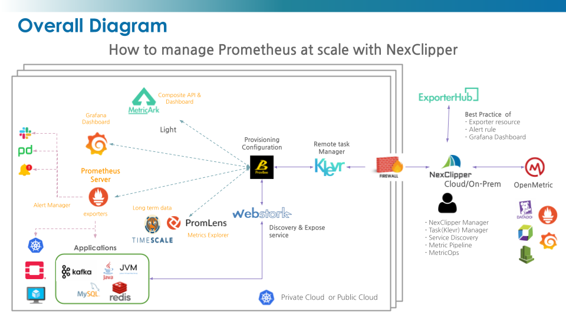
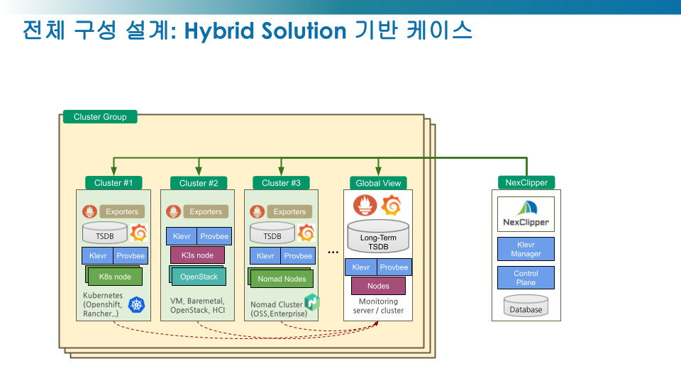

** github action, circle ci, test badge 표기 영역 **

**Previous version has been moved to NexClipperBasic repository: [NexClipperBasic](https://github.com/NexClipper/NexClipperBasic)**

# NexClipper

Managed Observability Platform At Anywhere.
Easy of set up and use for Observability Solution at your own cloud

The primary goal of NexClipper is to make it easy to set up and use the Observability platform in your own cloud environment, putting the highest priority on ensuring observability in any environment.

![nexclipper-service][./asset/banner.png]

# Main Features

- Management of Prometheus Life Cycle
  - Provisioning Observability-Stack with Prometheus Eco-system on cloud providers, on-premise or hybrid cloud.
  - Monitoring of Kubernetes, Nomad, OpenStack
  - Exposing service of Prometheus Eco-system
  - Managing Prometheus, Alertmanager Configuration
  - Support Long-term storages

-  Cloud Native Management
  - klevr features ?
  - Alerthub (Alerts Manage, ?? )
  - Global-View (Multi-Clusters)
  - DevOps Integration (Gitops, MetricOps)
  - Prometheus based status(State/Event/Metric) Composite API

- Best Practices
  - Consolidated Exporters database and catalog
  - NexClipper Manager Integration
  - Recommend Alert-rule, Grafana Dashboard

# Tech Stacks 

해당 그림에 신규 기능들 추가 필요 (alerthub, nomad, openstack)

해당 그림에 대한 간략한 설명

## Our OpenSources

- [Klevr](https://github.com/NexClipper/klevr) : Asynchronous distributed infrastructure management
- [Provbee](https://github.com/NexClipper/provbee) : Provisioning and Task Processing
- [MetricArk](https://github.com/NexClipper/MetricArk) : Basic Dashboard & Serving composite API
- [ExporterHub](https://github.com/NexClipper/exporterhub.io) : A Curated List of Prometheus Exporters
- [WebStork](https://github.com/NexClipper/webstork) : Web tunnel for Cloud-native application

## Observability OpenSources 

- Prometheus
- node-exporter
- kube-state-metrics
- kube-prometheus
- Alertmanager
- Pushgateway
- Promscale
- TimescaleDB
- Grafana
- Loki

## Commercial Product

- [Promlens](https://promlens.com/)

# Architecture

# Resource

## Quick Start
Service Banner image & link

## Documentation
github page link

# Roadmap

# Members

- Ralf
- Choppa
- Jay
- Jian
- Samsol
- Joel
- Peter
- Jeff
- Junhwan
- Jinwoong

# Company

NexClipper or NexCloud
